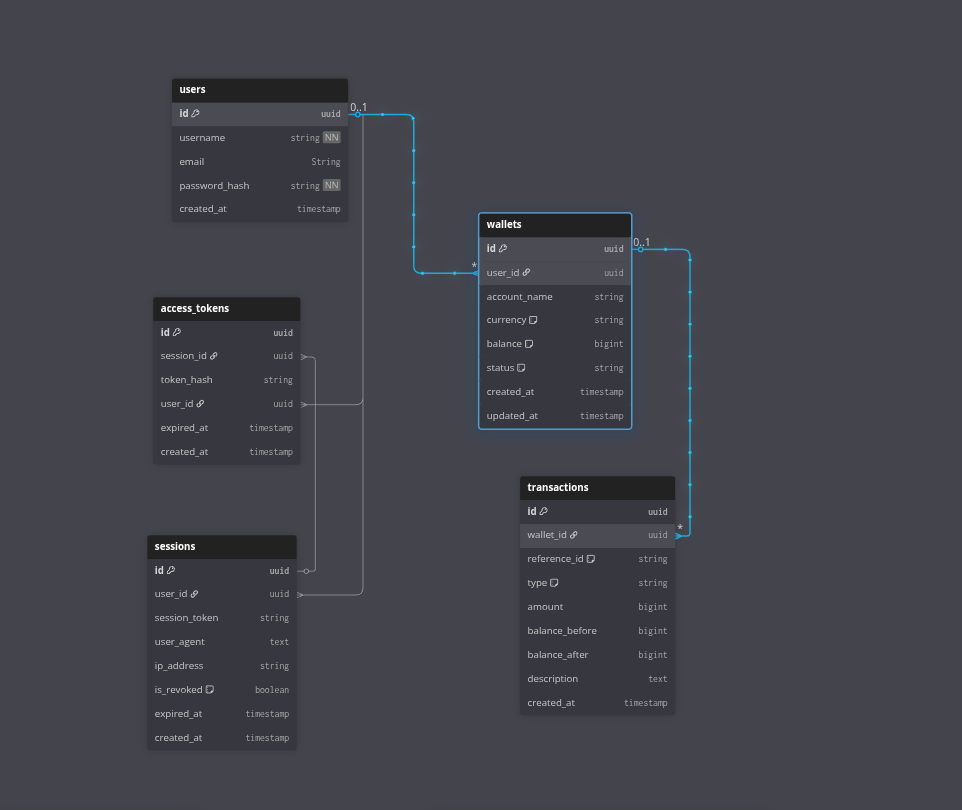
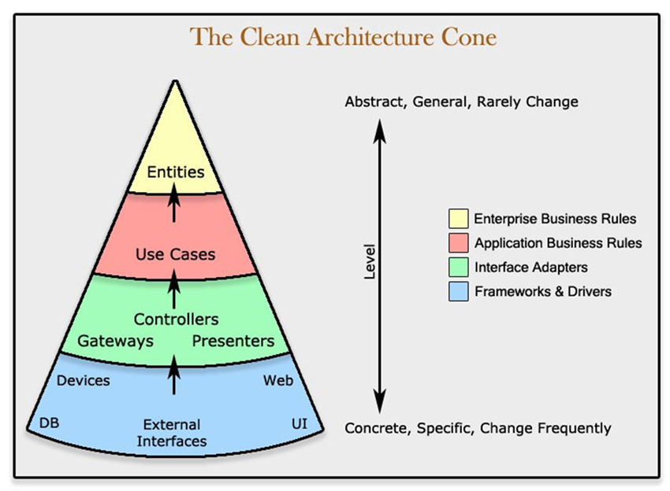

# Wallet API

Layanan REST API wallet sederhana yang dibangun dengan Go dan prinsip Clean Architecture.

[](docs/api/)
[](docs/postman/)
[](https://golang.org/)
[](LICENSE)

> **🚀 Mulai Cepat**: [Bruno](docs/api/) atau [Postman](docs/postman/) collections tersedia untuk testing semua endpoint!

## Fitur

- **Autentikasi Pengguna**
  - Autentikasi berbasis JWT (access + refresh tokens)
  - Penyimpanan token berbasis cookie HttpOnly (proteksi XSS)
  - Hashing password aman dengan bcrypt
  - Registrasi dan login pengguna

- **Manajemen Wallet**
  - Buat banyak wallet per pengguna
  - Dukungan banyak mata uang (IDR, USD, dll)
  - Manajemen status wallet (aktif, tidak aktif, dibekukan)
  - Presisi monetik menggunakan NUMERIC(20,2) dan decimal library

- **Pemrosesan Transaksi**
  - Setor dan tarik dana dengan presisi decimal
  - Transfer dana antar wallet
  - Riwayat transaksi dengan pagination
  - Pelacakan saldo sebelum/setelah transaksi dengan presisi exact
  - Dukungan idempotensi dengan reference ID
  - Pessimistic locking (SELECT FOR UPDATE) untuk mencegah race conditions
  - Transaksi atomik untuk konsistensi data
  - Menggunakan shopspring/decimal untuk integritas data keuangan

- **Keamanan**
  - Autentikasi berbasis cookie (HttpOnly, Secure, SameSite)
  - Hashing password dengan bcrypt (cost 12)
  - JWT access tokens (kadaluarsa 15 menit)
  - JWT refresh tokens (kadaluarsa 7 hari)
  - Validasi input

- **Arsitektur**
  - Clean Architecture dengan pendekatan pragmatis
  - Struktur modular (user, account modules)
  - Dependency injection berbasis interface
  - Generic base repository pattern
  - Request/Response DTOs
  - Bruno API collection untuk testing
  - Postman API collection untuk testing

## 📝 Recent Updates & Breaking Changes

### v1.1.0 - Wallet & Monetary Precision Update (Latest)

**🎉 Major Improvements:**
- ✨ **Email Support**: User registration sekarang membutuhkan field `email` (unik per user)
- ✨ **Monetary Precision**: Menggunakan `NUMERIC(20,2)` di database + `shopspring/decimal` di Go untuk presisi exact
- ✨ **Wallet Naming**: Konsisten menggunakan istilah "Wallet" daripada "Account"
- ✨ **API Endpoint**: Endpoint berubah dari `/v1/accounts` → `/v1/wallets`

**Breaking Changes:**

| Change | Old | New |
|--------|-----|-----|
| **Endpoint** | `/v1/accounts/*` | `/v1/wallets/*` |
| **Register Request** | `username`, `password` | `username`, `email`, `password` |
| **Update Profile Request** | `username` | `username`, `email` |
| **Create Wallet Request** | `account_name` | `wallet_name` |
| **Amount Type** | `integer` | `string` (dengan presisi desimal) |
| **Balance Response** | `integer` | `string` (format desimal) |
| **Transfer Request** | `to_account_id` | `to_wallet_id` |

**API Request Examples:**

**Old Format (v1.0.0):**
```json
// Register
{
  "username": "testuser",
  "password": "password123"
}

// Deposit
{
  "amount": 100000,
  "description": "Deposit"
}
```

**New Format (v1.1.0):**
```json
// Register
{
  "username": "testuser",
  "email": "testuser@example.com",
  "password": "password123"
}

// Deposit
{
  "amount": "100000.50",
  "description": "Deposit"
}
```

**API Response Examples:**

**Old Format (v1.0.0):**
```json
{
  "balance": 100000
}
```

**New Format (v1.1.0):**
```json
{
  "balance": "100000.50"
}
```

**Database Changes:**
- `accounts` table → `wallets` table
- `account_name` column → `wallet_name` column
- `transactions.account_id` → `transactions.wallet_id`
- `balance`, `amount`, `balance_before`, `balance_after` → `NUMERIC(20,2)` (dari `BIGINT`)

**Migration Guide:**

Untuk yang sudah menggunakan API v1.0.0:

1. **Update Request Body**:
   - Tambahkan `email` saat register
   - Ubah `amount` dari number ke string
   - Ubah `account_name` → `wallet_name`
   - Ubah `to_account_id` → `to_wallet_id`

2. **Update Endpoint URLs**:
   - Ganti semua `/v1/accounts/` → `/v1/wallets/`

3. **Update Response Parsing**:
   - `balance`, `amount` sekarang string, bukan number
   - Parse sebagai string untuk presisi desimal

**Why These Changes?**

- **Email**: Memenuhi standar modern auth dengan email sebagai identifier unik
- **NUMERIC + Decimal**:
  - ❌ `BIGINT`/`float64` memiliki precision loss untuk nilai uang
  - ✅ `NUMERIC(20,2)` + `shopspring/decimal` memberikan presisi exact
  - Menghindari floating-point errors dalam perhitungan keuangan
  - Best practice untuk financial applications
- **Wallet vs Account**: Lebih jelas dan sesuai konteks aplikasi
- **String Amount**: Client mengirim sebagai string → server parse sebagai decimal → kembali sebagai string. Presisi terjaga!

**Technical Details:**

```go
// Old: int64 (loss of precision)
amount := 100000  // 1000.00 will be 1000

// New: decimal.Decimal (exact precision)
amount := decimal.NewFromString("100000.50")  // Exactly 100000.50
balance := balance.Add(amount)  // No precision loss!
```

**Rollback Migration:**
```bash
# Jika perlu rollback
make migrate-down
```

**New Dependencies:**
- `github.com/shopspring/decimal` v1.4.0 - Decimal arithmetic for monetary values

---

## Tech Stack

- **Bahasa**: Go 1.25
- **Web Framework**: Fiber v2.52.10
- **ORM**: GORM v1.31.1
- **Database**: PostgreSQL 18
- **Autentikasi**: JWT (golang-jwt/jwt/v5)
- **Migrations**: golang-migrate/migrate
- **Password Hashing**: bcrypt
- **Decimal Math**: shopspring/decimal (presisi monetik)
- **Hot Reload**: Air (development)
- **API Testing**: Bruno collection included

## Struktur Project

```
wallet_api/
├── cmd/
│   ├── app/
│   │   └── main.go              # Entry point aplikasi
│   └── seed/
│       └── main.go              # Database seeder
├── internal/
│   ├── app/
│   │   ├── app.go               # Inisialisasi aplikasi
│   │   └── migrate.go           # Database migrations
│   ├── common/
│   │   ├── base/
│   │   │   └── base.repository.go   # Generic repository pattern
│   │   ├── consts/
│   │   │   └── consts.go            # Konstanta aplikasi
│   │   ├── errors/
│   │   │   └── error.go             # Tipe error
│   │   └── response/
│   │       └── response.go          # Helper response API
│   ├── entity/
│   │   ├── user.go               # Entity user
│   │   ├── wallet.go             # Entity wallet
│   │   ├── transaction.go        # Entity transaction
│   │   ├── session.go            # Entity session
│   │   └── access_token.go       # Entity access token
│   ├── middleware/
│   │   ├── auth.go               # Middleware autentikasi JWT
│   │   ├── logger.go             # Logging request HTTP
│   │   └── recovery.go           # Panic recovery
│   ├── module/
│   │   ├── account/              # Module wallet/akun
│   │   │   ├── account.module.go
│   │   │   ├── account.router.go
│   │   │   ├── handler/
│   │   │   │   └── account.handler.go
│   │   │   ├── usecase/
│   │   │   │   └── account.usecase.go
│   │   │   ├── repository/
│   │   │   │   ├── wallet.repository.go
│   │   │   │   └── transaction.repository.go
│   │   │   └── dto/
│   │   │       ├── request/
│   │   │       │   └── account.request.go
│   │   │       └── response/
│   │   │           └── account.response.go
│   │   └── user/                 # Module user
│   │       ├── user.module.go
│   │       ├── user.router.go
│   │       ├── handler/
│   │       │   └── user.handler.go
│   │       ├── usecase/
│   │       │   └── user.usecase.go
│   │       ├── repository/
│   │       │   └── user.repository.go
│   │       └── dto/
│   │           ├── request/
│   │           │   └── user.request.go
│   │           └── response/
│   │               └── user.response.go
│   ├── router/
│   │   ├── module.go             # Inisialisasi router global
│   │   └── router.go            # Router setup dengan middleware
│   └── utils/
│       ├── jwt.go                # Utilitas JWT (baca dari env)
│       ├── cookie.go             # Manajemen cookie
│       └── password.go           # Hashing password
├── config/
│   └── config.go                # Konfigurasi aplikasi (load .env)
├── pkg/
│   ├── httpserver/              # HTTP server wrapper
│   ├── logger/                  # Logger interface
│   └── postgres/                # PostgreSQL connection
├── migrations/                   # Database migrations
├── integration-test/            # Integration tests
│   └── integration_test.go      # Complete API test suite
├── docs/
│   ├── images/                  # Diagrams (ERD, Clean Architecture)
│   └── api/                     # Bruno API collection
├── devops-challenge/            # DevOps & deployment setup
│   ├── k8s/                     # Kubernetes manifests
│   └── *.yml                    # Docker & CI/CD configs
├── .air.toml                    # Konfigurasi hot reload Air
├── .env                         # Environment variables (local)
├── .env.example                 # Template environment variables
├── docker-compose.yml           # Docker services
├── Dockerfile                    # Multi-stage Docker build
├── Makefile                     # Perintah build & run
└── go.mod                       # Dependensi Go
```

## Mulai Cepat

### Test API dengan Bruno atau Postman

Tidak mau coding? Test semua endpoint langsung!

**Opsi 1: Bruno (Recommended)**
1. Install [Bruno](https://www.usebruno.com/)
2. Import [Bruno Collection](docs/api/)
3. Mulai test semua endpoint
[📖 Dokumentasi Bruno](docs/api/README.md)

**Opsi 2: Postman**
1. Install [Postman](https://www.postman.com/downloads/)
2. Import [Postman Collection](docs/postman/)
3. Mulai test semua endpoint
[📖 Dokumentasi Postman](docs/postman/README.md)

### Jalankan Aplikasi

**Menggunakan Docker Compose (Disarankan)**

```bash
make compose-up-all
# Aplikasi tersedia di http://localhost:8080
```

**Setup Manual**

```bash
make deps
make migrate-up
make run
```

**Hot Reload (Development)**

```bash
make dev
```

## Variabel Lingkungan

| Variabel | Deskripsi | Default |
|----------|-----------|---------|
| `APP_NAME` | Nama aplikasi | `wallet_api` |
| `APP_VERSION` | Versi aplikasi | `1.0.0` |
| `HTTP_PORT` | Port server HTTP | `8080` |
| `LOG_LEVEL` | Level logging | `debug` |
| `PG_URL` | Connection string PostgreSQL | - |
| `PG_POOL_MAX` | Koneksi maksimum database | `2` |
| `JWT_SECRET` | Secret key untuk JWT | - |
| `ACCESS_TOKEN_EXPIRY` | Kadaluarsa access token (menit) | `15` |
| `REFRESH_TOKEN_EXPIRY` | Kadaluarsa refresh token (hari) | `7` |

## API Endpoints

### Autentikasi

| Method | Endpoint | Deskripsi | Auth Required |
|--------|----------|-----------|---------------|
| POST | `/v1/auth/register` | Registrasi user baru | Tidak |
| POST | `/v1/auth/login` | Login user | Tidak |
| POST | `/v1/auth/logout` | Logout user | Ya |
| POST | `/v1/auth/refresh` | Refresh access token | Tidak |

### Profil User

| Method | Endpoint | Deskripsi | Auth Required |
|--------|----------|-----------|---------------|
| GET | `/v1/users/profile` | Ambil profil user | Ya |
| PUT | `/v1/users/profile` | Update profil user | Ya |

### Wallet

| Method | Endpoint | Deskripsi | Auth Required |
|--------|----------|-----------|---------------|
| POST | `/v1/wallets` | Buat wallet baru | Ya |
| GET | `/v1/wallets/:id` | Ambil wallet berdasarkan ID | Ya |
| GET | `/v1/wallets` | Ambil semua wallet user | Ya |
| POST | `/v1/wallets/:id/deposit` | Setor ke wallet | Ya |
| POST | `/v1/wallets/:id/withdraw` | Tarik dari wallet | Ya |
| POST | `/v1/wallets/:id/transfer` | Transfer ke wallet lain | Ya |
| GET | `/v1/wallets/:id/transactions` | Ambil transaksi wallet | Ya |

### Health Check

| Method | Endpoint | Deskripsi |
|--------|----------|-----------|
| GET | `/healthz` | Endpoint health check |

## Skema Database

### Entity Relationship Diagram



## Perintah Make

```bash
# Development
make run                         # Jalankan aplikasi
make dev                         # Jalankan dengan hot reload menggunakan air
make deps                        # Tidy dan verifikasi dependensi
make bin-deps                    # Install development tools

# Docker
make compose-up                  # Start database saja
make compose-up-all              # Start database + app
make compose-down                # Stop semua Docker services
make nuke                        # Hapus semua containers, volumes, dan networks

# Database
make migrate-create NAME=name    # Buat migration baru
make migrate-up                  # Jalankan migrations
make migrate-down                # Rollback migration terakhir (1 langkah)
make migrate-down-all            # Rollback semua migrations
make seed                        # Jalankan database seeder

# Testing
make test                        # Jalankan unit tests
make integration-test            # Jalankan integration tests

# Code Quality
make format                      # Format code
make linter-golangci             # Jalankan golangci-lint
make pre-commit                  # Jalankan pre-commit checks
```

## Highlight Arsitektur

### Diagram Clean Architecture



### Prinsip Clean Architecture

- **Dependency Injection**: Semua dependensi di-inject melalui constructor
- **Desain Berbasis Interface**: Repository dan UseCase didefinisikan sebagai interface
- **Pemisahan Layer**: Handler → UseCase → Repository → Entity
- **Enkapsulasi**: Tipe concrete private, interface public

### Struktur Module

Setiap module mengikuti pola ini:
```
module/
├── module.go         # Inisialisasi module (DI)
├── router.go         # Registrasi route
├── handler/          # HTTP handlers
├── usecase/          # Business logic
├── repository/       # Data access
└── dto/              # Request/Response DTOs
    ├── request/      # Request DTOs
    └── response/     # Response DTOs + mappers
```

## Format Response

Semua response API mengikuti format ini:

**Response Sukses**:
```json
{
  "success": true,
  "message": "Operasi berhasil",
  "data": { ... }
}
```

**Response Error**:
```json
{
  "success": false,
  "error": {
    "code": 400,
    "message": "Pesan error"
  }
}
```

## Testing

### Integration Tests

Integration tests memverifikasi seluruh flow API dari HTTP request sampai operasi database.

```bash
# Start services terlebih dahulu
make compose-up-all

# Jalankan integration tests menggunakan make
make integration-test

# Atau jalankan langsung dengan go
go test -v ./integration-test/... -count=1
```

### Unit Tests

```bash
# Jalankan unit tests menggunakan make
make test

# Atau jalankan dengan go langsung
go test ./...

# Jalankan tests dengan coverage
go test -cover ./...

# Jalankan tests dengan race detection (local development)
make test-race

# Jalankan tests dengan verbose output
go test -v ./...
```

### Test dengan Bruno atau Postman

Untuk testing API manual, gunakan:

**Bruno** (Recommended):
1. Install [Bruno](https://www.usebruno.com/)
2. Import collection dari `docs/api/`
3. Test semua endpoint secara interaktif
[Lihat Dokumentasi Bruno](docs/api/README.md)

**Postman**:
1. Install [Postman](https://www.postman.com/downloads/)
2. Import collection dari `docs/postman/`
3. Test semua endpoint dengan auto-variables
[Lihat Dokumentasi Postman](docs/postman/README.md)

## DevOps & Deployment

Setup DevOps lengkap untuk production deployment tersedia di direktori `/devops-challenge`:

### 🐳 Docker & Docker Compose
- Multi-stage Dockerfile untuk image production yang optimal
- Docker Compose untuk local development dan testing
- Health checks dan security best practices

### ☸️ Kubernetes Deployment
- Complete K8s manifests (Deployment, Service, Ingress, HPA)
- ConfigMap untuk configuration management
- Secrets untuk sensitive data (DB credentials, JWT secret)
- PostgreSQL StatefulSet dengan persistent storage
- Horizontal Pod Autoscaler (3-10 replicas)
- Script auto-deployment

### 🔄 CI/CD Pipeline (GitHub Actions)
- Automated testing dengan PostgreSQL service
- Build & push Docker image ke GHCR
- Coverage reporting
- Automatic deployment ke Kubernetes (optional)

### 📚 Dokumentasi Lengkap
Lihat dokumentasi lengkap di:
- [DevOps Challenge README](devops-challenge/README.md) - Panduan deployment lengkap
- [File Organization](devops-challenge/FILE_ORGANIZATION.md) - Penjelasan struktur file

### Quick Deploy

```bash
# Local dengan Docker Compose
cd devops-challenge
docker-compose up -d

# Deploy ke Kubernetes
cd devops-challenge/k8s
./deploy.sh
```

**Deployment Pipeline:**
1. ✅ Push code ke GitHub
2. ✅ GitHub Actions run tests
3. ✅ Build Docker image (jika tests pass)
4. ✅ Push ke GitHub Container Registry
5. ✅ Deploy ke Kubernetes cluster (optional)
